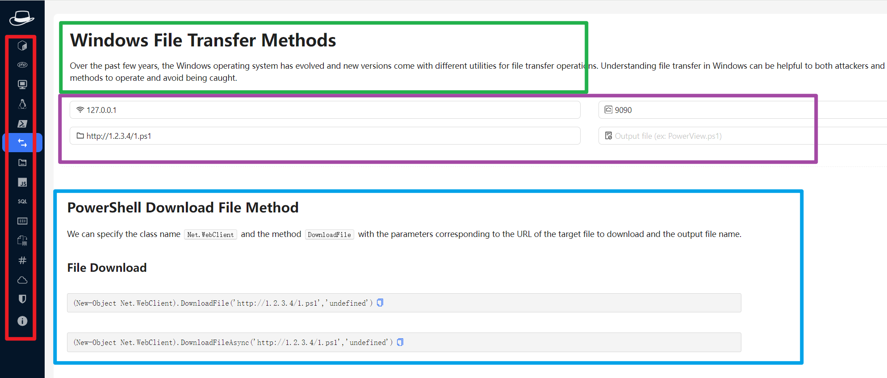

# ComLines
 A custom check list of command lines

# 需求背景

工作中有非常多的命令行需要用，背不下来。用笔记软件自然非常好使，但很多时候命令行中需要修改一些参数，比如ip地址、用户名等，这时候就得复制出来做修改再复制粘贴使用。如果需要再对字符串做编解码、拼接、正则、文本替换等需求，就很难用笔记软件实现了。

# 参考项目
- https://gchq.github.io/CyberChef/
- https://github.com/LasCC/HackTools

这两个工具都很好但都有不足:
1. 赛博厨子有非常丰富的加解密编解码等数据处理功能，但似乎只能对输入输出全量的运算，逻辑类似于output = hex(utf16(b58(b64(input))))，我们需要这样的运算逻辑：output = hex(b64(text1) + ":" + b64(text2))
2. hacktools前端很不错，但他毕竟是个浏览器插件，没有url跳转也没有锚点，而且能力扩充比较困难，需要改代码编译
# Todo清单以及优先级



1. \[1\] React + Typescript
2. \[1\]前端风格类似 [HackTools](https://github.com/LasCC/HackTools)
3. 左侧边栏为功能目录(红框)，右侧窗口上部为这个功能目录的介绍(绿框)，有些目录可以让用户指定参数(紫框)(可有可无)，下部为指定目录下的功能区(蓝框)
4. 功能目录用于切换不同目录；介绍框就只是文本框而已，介绍背景和概念；参数区指定的参数会拼接到功能区的文本中；功能区用于类似markdown的格式展示文本和标题等信息
5. \[2\]支持通过url切换不同目录(路由)，支持通过锚点定位到功能区下不同的标题 
6. \[2\]为了提高可用性，需要支持通过锚点向参数区传递参数
7. \[3\]为了提高可扩展性，前端可以通过导入json的方式自动渲染前端目录和对应功能区参数区 
8. \[3\]可以通过修改json并导入，实现能力扩展，甚至可以通过发布json包的方式提供各种场景的命令清单，比如运维场景、安全场景、docker场景等
9. \[3\]需要在代码层面设计一些算子，以便在json中调用 
10. \[4\]必要的时候由用户自己开发算子，这方面似乎很难提供扩展性
11. \[1\]需要实现一个json的格式规范


```
npm start
```